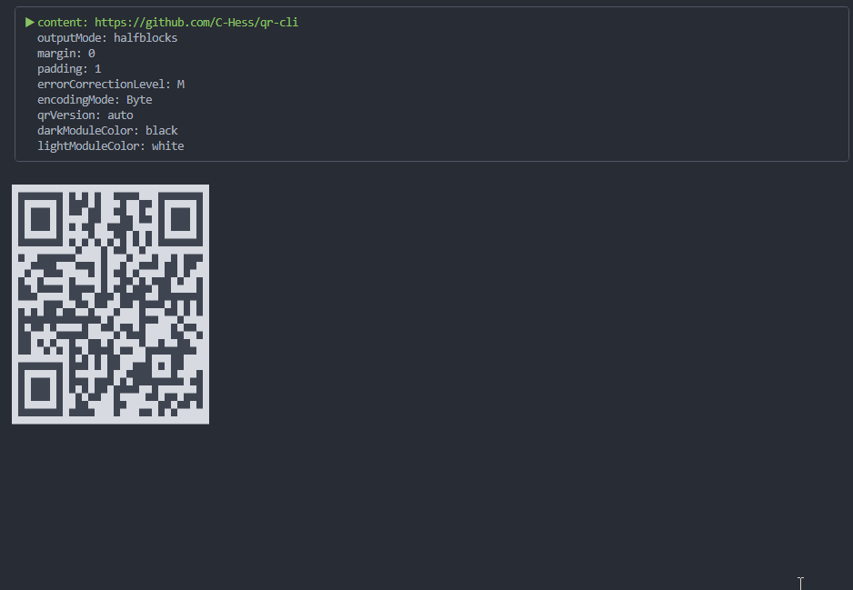

# qr-cli

Terminal QR codes with an Ink-first developer experience.

Drop in a ready-to-use `QrCode` component for Ink apps, or use the CLI for quick terminal output.

[](https://www.npmjs.com/package/@qr-cli/cli)
[](https://www.npmjs.com/package/@qr-cli/ink)
[](https://www.npmjs.com/package/@qr-cli/renderer)

<p align="center">
  
</p>

`qr-cli` is available as:

- `@qr-cli/cli`: command-line QR output for terminals
- `@qr-cli/ink`: Ink/React component for terminal UIs
- `@qr-cli/renderer`: low-level QR rendering library

## CLI Quick Start

Install globally:

```bash
npm install -g @qr-cli/cli
qr-cli "https://github.com/C-Hess/qr-cli"
```

Or run with `npx`:

```bash
npx @qr-cli/cli "https://github.com/C-Hess/qr-cli"
```

You can also pipe input from stdin:

```bash
echo "https://github.com/C-Hess/qr-cli" | qr-cli
```

## Using In Ink (React TUI)

Install dependencies:

```bash
npm install @qr-cli/ink ink react
```

If the Ink component is your main integration point, use `@qr-cli/ink` and drop in `QrCode`.

```tsx
import React from "react";
import { render } from "ink";
import { QrCode } from "@qr-cli/ink";

function App() {
  return (
    <QrCode
      content="https://github.com/C-Hess/qr-cli"
      renderOptions={{
        outputMode: "halfblocks",
        errorCorrectionLevel: "M",
        margin: 2
      }}
      darkModuleColor="black"
      lightModuleColor="white"
    />
  );
}

render(<App />);
```

Useful `QrCode` props:

- `content` (required): value to encode
- `renderOptions`: `margin`, `padding`, `errorCorrectionLevel`, `encodingMode`, `qrVersion`, `outputMode`
- `darkModuleColor`: Ink foreground color for dark modules
- `lightModuleColor`: Ink background/light module color

For Ink, color styling comes from `darkModuleColor` and `lightModuleColor`.

## CLI Options

- `--margin <n>`: quiet-zone width in modules (default: `2`)
- `--padding <n>`: outer padding width in modules (default: `1`)
- `--error-correction <L|M|Q|H>`: EC level (alias: `--ec`, default: `M`)
- `--qr-version <n|auto>`: QR version (`0` or `auto` = automatic)
- `--encoding <numeric|alphanumeric|byte|kanji>`: encoding mode (alias: `--mode`)
- `--color-scheme <none|high-contrast>`: terminal coloring (alias: `--color`)
- `--output-mode <halfblocks|fullblocks>`: render style (alias: `--output`)
- `--no-newline`: omit trailing newline
- `--help`: usage help
- `--version`: CLI version

Shorthand accepted for output mode:

- `--output half`
- `--output full`
